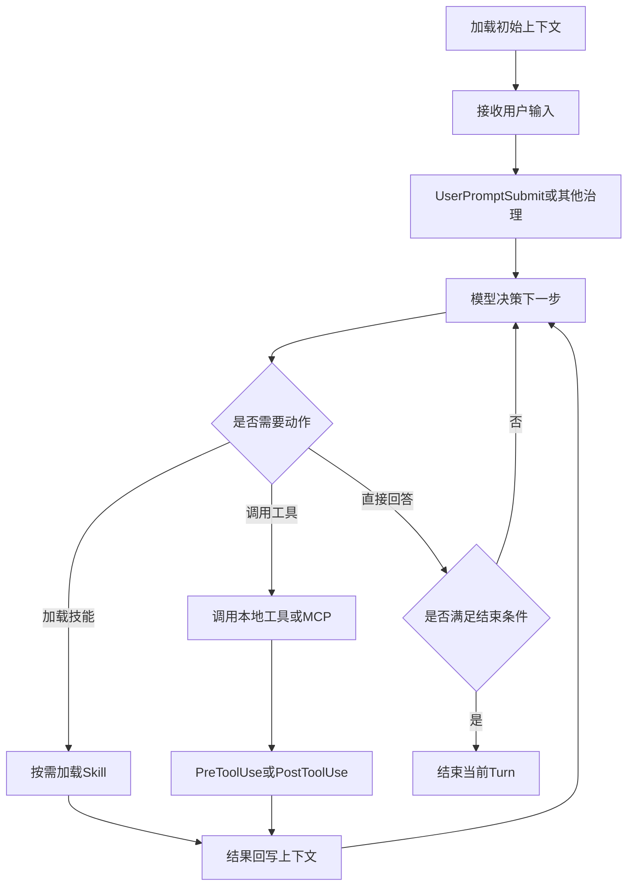

# Claude Code 的核心逻辑，以及它和 OpenAI Agent Builder、Google ADK 的本质区别

## 一句话结论

如果只用一句话概括：

- 你把 `Claude Code` 理解成一个 `loop`，这个方向是对的。
- 但更准确的说法不是“一个简单的 prompt -> tool -> prompt 循环”，而是：**以 agentic loop 为主干，以 hooks 和 memory 为治理层，以 MCP 和 skills 为能力扩展层的产品化 agent runtime**。
- 与它相比，`OpenAI Agent Builder` 更像**可视化工作流编排系统**，而 `Google ADK` 更像**事件驱动的 agent runtime 框架**。

所以三者虽然都在做“Agent”，但它们的核心抽象并不在同一层：

- `Claude Code`：产品化的自治式 coding agent
- `OpenAI Agent Builder`：工作流即系统
- `Google ADK`：运行时即系统

---

## 先纠偏：我对 Claude Code 的理解，哪些是对的，哪些需要修正

你原本的理解是：

> Claude Code 的核心就是一个 loop，拿到用户 prompt 后，进入 loop，通过 LLM 分析，调用触发的 tools 或者 skill，拿到结果后，再次进行 LLM 分析。直到触发 stop，退出 loop。

这个理解里，**主干是对的**，但还需要几个关键修正。

### 1. 对的部分：Claude Code 的确是 agentic loop

Claude Code 的核心运行方式，确实可以概括成：

1. 读取当前上下文
2. 让模型判断下一步做什么
3. 如果需要，就调用工具
4. 把工具结果重新放回上下文
5. 再次判断下一步
6. 直到本轮任务结束

也就是说，它不是“一次性生成答案”，而是**多步推理 + 多步执行**。

这也是 Claude Code 和普通聊天机器人最本质的区别：  
它不只是“回答你”，而是会**读项目、找信息、调用工具、执行动作、校验结果，再决定下一步**。

### 2. 需要修正的部分：`skill` 不是 loop 中每轮都固定经过的一环

很多人容易把 `skill` 理解成类似 `tool` 的“执行器”，但在 Claude Code 里，它更像：

- 一个按需装载的能力包
- 一套面向特定任务的操作说明
- 一种可复用的工作流模板

更准确地说：

- `tool` 是模型可以调用的动作能力
- `skill` 是模型或用户可以激活的任务套路和操作指南

所以 Claude Code 的主循环，准确写法应该是：

`用户输入 -> 模型决策 -> 调用工具 / 激活相关技能 / 读取更多上下文 -> 更新上下文 -> 再次决策`

而不是：

`用户输入 -> 模型 -> tool/skill -> 模型 -> tool/skill`

因为 `skill` 并不是每轮都会被显式调用。

### 3. 需要修正的部分：`memory` 不等于“每轮新数据都会变成长期记忆”

Claude Code 里的“记忆”至少要拆成两层：

#### 会话内上下文

这是当前这一轮工作里不断增长的内容，例如：

- 用户新输入
- 已读文件内容
- 工具执行结果
- MCP 返回的数据
- 过程中形成的摘要或压缩内容

这些内容会进入后续模型调用的 prompt，因此你说“每次循环的新数据会作为下次调用 LLM 的 prompt”，**这个说法在会话内是成立的**。

#### 跨会话记忆

这部分不是“当前 session 自动无限累积”，而是依靠 Claude Code 的持久化机制，例如：

- `CLAUDE.md`
- `CLAUDE.local.md`
- `.claude/rules/`
- auto memory

Anthropic 官方文档明确强调：**每个新会话都从一个新的 context window 开始**。  
也就是说，Claude Code 并不是天然带着“之前所有聊天历史”进入新会话。

它跨会话依赖的，是上面这些持久化说明和自动记忆机制，而不是简单地把所有历史对话全文塞回去。

### 4. 需要修正的部分：`stop` 不是只有“模型觉得答完了”

如果只从 loop 角度理解，很容易把 stop 看成：

- 模型不再调用工具
- 模型输出最终答案
- turn 结束

但 Claude Code 实际上还有更完整的生命周期语义：

- 模型自然结束本轮回复
- `Stop` hook 触发
- hook 可以放行，也可以阻断结束并要求继续
- 用户可能手动中断
- API 错误则会走 `StopFailure`

所以 `stop` 不是一个单纯的“模型内部状态”，而是**运行时生命周期的一部分**。

### 5. 需要修正的部分：`hook` 不是边角功能，而是治理面

你提到：

> hook，在执行过程中，对输入数据或者输出数据进行固定的加工转换等明确的操作

这个理解也对，但还可以提升一个层级：

`hook` 本质上不是“加工函数”这么简单，而是 Claude Code 的**确定性治理机制**。

它可以在多个生命周期点介入，例如：

- `UserPromptSubmit`
- `PreToolUse`
- `PostToolUse`
- `PostToolUseFailure`
- `Notification`
- `Stop`

这意味着 hook 不只是“改一改输入输出”，而是在 Claude Code 的 agentic loop 外面套了一层**可观测、可拦截、可约束、可自动化**的控制面。

---

## Claude Code 的核心逻辑，应该怎么表述

我建议把 Claude Code 的核心逻辑表述成下面这句话：

> Claude Code 的核心不是单一的“模型循环”，而是一个以模型决策为中心的 agentic loop。这个 loop 在每一轮中结合当前上下文做出下一步决策，按需调用本地工具、MCP 工具或技能，并通过 hooks、权限机制和记忆系统对执行过程进行治理，直到当前回合满足结束条件。

如果要再压缩一点，可以写成：

> Claude Code = `agentic loop + memory loading + tool/MCP execution + hook-based governance`

### 一个更准确的分层模型

可以把 Claude Code 看成四层：

#### 1. 决策层：LLM

负责判断：

- 当前用户想完成什么
- 下一步需要读取什么上下文
- 是否要调用工具
- 是否需要继续分解任务
- 是否已经可以结束当前回合

#### 2. 能力层：Tools / MCP / Skills

负责“能做什么”：

- 本地工具：读文件、搜索、编辑、执行命令等
- `MCP`：把外部系统能力接进来
- `skills`：把复杂工作流或操作套路封装起来

#### 3. 治理层：Hooks / Permissions / Status

负责“怎么安全、可控地做”：

- 工具调用前后是否允许
- 是否需要用户批准
- 某些操作是否要被阻止
- 执行过程中显示什么状态
- 回合结束时是否真正结束

#### 4. 记忆层：Context / CLAUDE.md / Auto memory

负责“做决定时带着哪些信息”：

- 当前会话上下文
- 项目级说明
- 用户级偏好
- 自动沉淀的长期记忆

---

## Claude Code 的简化运行流程

如果从运行时角度写，我建议用下面这套 8 步流程。

### Step 1：启动会话，装载初始上下文

Claude Code 在一个新会话开始时，不是“空白启动”，而是会先加载一些背景信息，例如：

- 系统级行为约束
- 当前工作目录信息
- 项目中的 `CLAUDE.md`
- 用户的 `CLAUDE.local.md`
- 相关 `.claude/rules/`
- auto memory 的摘要信息
- 当前可用的工具与技能描述

注意，这一步已经说明它不是单纯的“拿到用户 prompt 才开始思考”，而是先形成一个**可工作的初始上下文**。

### Step 2：接收用户输入

用户输入进入会话后，可能先触发 `UserPromptSubmit` 一类 hook。  
也就是说，**用户输入不是直接无条件送给模型**，而是可能先经过运行时治理逻辑。

### Step 3：模型基于当前上下文做出下一步决策

模型不会只做“回答生成”，而是要决定：

- 直接回答
- 读取更多文件
- 调用某个工具
- 调用 MCP
- 激活某个 skill
- 继续拆解问题

这一阶段是整个系统的决策中心。

### Step 4：进入工具或外部能力执行阶段

一旦模型决定调用工具，就会进入执行链路：

- 先经过 `PreToolUse`
- 再判断权限或是否需要批准
- 然后实际执行工具
- 工具成功则触发 `PostToolUse`
- 工具失败则触发 `PostToolUseFailure`

这说明工具调用不是一个“黑盒动作”，而是**受运行时生命周期管理的动作**。

### Step 5：把执行结果写回上下文

无论是：

- 本地工具结果
- MCP 返回的数据
- skill 产生的新操作指导
- 文件读取内容

都会被重新注入当前上下文，供下一轮模型决策使用。

这一步就是你原先理解里“新的数据会作为下一次 prompt”的核心来源。

### Step 6：模型再次判断是否继续

拿到新结果后，模型会重新判断：

- 信息是否足够
- 是否还要继续调用工具
- 是否需要进一步验证
- 是否应该结束本轮

所以 Claude Code 的 loop，本质上是一个**决策 - 执行 - 回写 - 再决策**的闭环。

### Step 7：必要时进行上下文整理与压缩

随着会话变长，上下文会膨胀。  
Claude Code 会通过上下文压缩、摘要等机制维持可用上下文窗口。

所以“memory”并不是简单做加法，而是包含：

- 新内容进入上下文
- 旧内容被压缩
- 关键内容被保留
- 长期内容靠记忆文件持续存在

### Step 8：满足结束条件后停止当前回合

本轮会在以下情况下结束：

- 模型认为当前任务已完成
- 没有进一步工具调用需求
- `Stop` hook 放行结束
- 或者因为用户中断、错误等原因提前终止

这里最重要的一点是：  
**Claude Code 的 stop 是运行时层的 turn completion，不只是模型层的“我说完了”。**

---

## Claude Code 的核心逻辑图

---

## Claude Code 中几个核心概念，各自到底是什么

### MCP：决定“Claude Code 还能接入什么能力”

`MCP` 的作用不是“又多了几个函数”，而是让 Claude Code 能接到更多外部能力源。

它可以把外部系统暴露成：

- 工具
- 资源
- 提示能力
- 外部事件通道

所以从架构角度看，MCP 解决的是：

> Claude Code 的能力边界如何被持续扩展

也就是说，`MCP` 决定的是系统的**外延能力面**。

### Skills：决定“复杂任务如何被套路化复用”

`skills` 不是底层执行引擎，而是任务能力包。

它适合承载：

- 某类任务的固定流程
- 某类输出的最佳实践
- 某类项目中的专有工作方法

所以 `skills` 决定的不是“Claude Code 是否能做”，而是：

> Claude Code 是否能更稳定、更高效地做某类任务

### Memory：决定“决策时带着什么背景”

Claude Code 的记忆系统不是一个单点能力，而是一套上下文装载机制：

- 当前 session 的上下文增量
- 项目长期说明
- 用户长期偏好
- 自动沉淀的长期记忆

所以 `memory` 解决的不是“能不能记住聊天记录”这么简单，而是：

> 模型在每一轮决策时，能看到哪些背景信息

### Hooks：决定“运行时如何被治理和约束”

如果说 LLM 负责“想”，工具负责“做”，那么 hooks 负责“管”。

它们的角色包括：

- 审核
- 拦截
- 记录
- 自动化
- 状态提示
- 固定规则执行

所以 hooks 是 Claude Code 里非常关键的**运行时治理平面**。

### Stop：决定“当前回合什么时候真的结束”

从工程角度看，`stop` 不是一个语义化词汇，而是 turn lifecycle 的结束点。

它背后实际包含：

- 模型结束输出
- 当前工具链路已完成
- 没有新的动作需要执行
- hook 不再阻止结束
- 本轮状态被视为完成

所以 `stop` 是一个**运行时终止判定**，不是单纯的“模型停止生成”。

---

## 和 OpenAI Agent Builder 对比：它不是同一种核心抽象

如果用一句话区分：

> `Claude Code` 重点在“自治执行”，`OpenAI Agent Builder` 重点在“可视化编排”。

### Agent Builder 的官方主叙事是什么

OpenAI 官方对 `Agent Builder` 的定义非常明确：  
它是一个 **visual canvas for building multi-step agent workflows**。

这句话很关键，因为它说明 Agent Builder 的一号抽象不是：

- runtime event loop
- coding agent product
- hidden autonomous loop

而是：

- workflow
- node
- edge
- typed input/output
- publishable asset

所以 Agent Builder 更像什么？

更像一个**把 agents、tools、logic、state 画成图并版本化发布的系统**。

### 它怎么表达控制流

OpenAI 官方文档里，控制流是显式建模的：

- `Start`
- `Agent`
- `MCP`
- `Guardrails`
- `If/else`
- `While`
- `Human approval`
- `Set state`

这一点和 Claude Code 很不一样。

在 Claude Code 里，循环更多是系统内部的 agentic loop；
在 Agent Builder 里，循环更多是**工作流图上的 `While` 节点**。

也就是说：

- `Claude Code`：系统内部自带 loop
- `Agent Builder`：开发者在工作流里画出 loop

### 它怎么处理状态和记忆

Agent Builder 里，“状态”和“记忆”更多是两个不同概念：

#### 状态

通过 `Set state` 节点定义全局变量，供整个 workflow 共享。

这是一种典型的**工作流状态管理**思路。

#### 记忆 / 知识

官方文档更强调：

- vector stores
- file search
- embeddings

也就是把 memory 主要放在**托管知识与检索增强**这条线上，而不是像 Claude Code 一样强调：

- `CLAUDE.md`
- project rules
- auto memory
- session context compaction

### 它怎么做可观测性

OpenAI 在这条线上很强，官方强调：

- trace
- trace grading
- logs
- evaluate

也就是说，Agent Builder 的典型思路是：

> 把 agent workflow 当成一个可观测、可评估、可版本化的流程资产

这和 Claude Code 的产品思路明显不同。

### 结论

如果做一句最简化定义：

> OpenAI Agent Builder 的核心不是“通用自治循环”，而是“节点化、类型化、可发布的 agent workflow 编排系统”。

---

## 和 Google ADK 对比：它更像显式的 agent runtime 框架

如果说 Claude Code 是一个已经封装好的 agent 产品，那么 Google ADK 更像把运行时骨架直接暴露给开发者。

### ADK 的核心是什么

Google ADK 的关键抽象非常明确：

- `Runner`
- `Event Loop`
- `Event`
- `Session`
- `State`
- `MemoryService`
- `Callbacks`
- `Workflow Agents`

这说明 ADK 的核心重心，不是产品体验层，而是**开发框架层的运行时语义**。

### ADK 的执行方式是什么

ADK 官方把核心执行模式定义成 `Event Loop`。

其基本模式是：

1. Runner 接收用户请求
2. Agent 开始执行
3. 执行过程中产出 `Event`
4. Runner 处理 event，并提交对应状态变化
5. Agent 在新的状态基础上继续执行
6. 直到没有更多 event

这和 Claude Code 有相似处，但差别很大：

- Claude Code 更像产品内部封装好的 agent loop
- ADK 则把 loop、event、state commit 这些机制显式框架化了

换句话说：

> Claude Code 把 runtime 包起来给你用，ADK 把 runtime 展开给你搭

### ADK 的状态模型为什么更“框架化”

ADK 在状态问题上比 Claude Code 的文档表达更结构化：

#### `Session`

代表当前对话线程。

#### `State`

代表当前 session 内部的数据。

#### `Memory`

代表跨 session 的可检索长期记忆。

#### `MemoryService`

代表长期记忆的管理器。

这种分层非常典型，像一个成熟框架里的运行时契约，而不只是产品能力说明。

### ADK 的 callbacks 和 Claude Code hooks 的差别

两者都允许你在执行流程中插入自定义逻辑，但抽象方式不同：

- `Claude Code hooks` 更偏产品生命周期拦截点
- `ADK callbacks` 更偏框架执行过程中的可编程回调

ADK 的 callbacks 可以发生在：

- `Before Agent`
- `After Agent`
- `Before Model`
- `After Model`
- `Before Tool`
- `After Tool`

并且返回值还能影响后续控制流。  
这一点很像在 runtime 里暴露出程序化插桩与拦截接口。

### ADK 的 `LoopAgent` 不等于 Claude Code 的 loop

这一点特别容易混淆。

`LoopAgent` 是 ADK 的一个工作流 primitive，属于开发者显式构建的编排组件。  
它的意思是：**你定义一个循环型 workflow agent，让它反复跑子 agent**。

而 `Claude Code` 的 loop 是整个系统默认的核心执行方式。

所以不能把两者混成一回事：

- `Claude Code loop`：系统级 agentic loop
- `ADK LoopAgent`：框架里可选的循环编排组件

### 结论

如果做一句最简化定义：

> Google ADK 的核心不是一个现成 agent 产品，而是一套显式的、事件驱动的 agent runtime 框架。

---

## 三者最本质的区别

把话说透一点，三者的最大区别不在“是不是也有 tool、memory、hook”，而在**系统的第一抽象是什么**。

### Claude Code 的第一抽象：自治执行

Claude Code 最先回答的问题是：

> 我怎样让一个 coding agent 在真实项目环境里自己工作起来？

所以它天然重视：

- agentic loop
- 文件与终端能力
- MCP 扩展
- hooks 治理
- 项目说明与长期记忆

### OpenAI Agent Builder 的第一抽象：工作流编排

Agent Builder 最先回答的问题是：

> 我怎样把 agent、tool、logic、state 组织成一个可发布的工作流？

所以它天然重视：

- canvas
- nodes
- typed edges
- `While` / `If/else`
- traces
- publish / deploy

### Google ADK 的第一抽象：运行时机制

ADK 最先回答的问题是：

> 我怎样给开发者一套明确的 runtime、event、state、memory、callback 机制，让他自己搭 agent 系统？

所以它天然重视：

- Runner
- Event Loop
- Session / State / MemoryService
- Workflow Agents
- Callbacks

---

## 一张表看懂三者差异

| 维度 | Claude Code | OpenAI Agent Builder | Google ADK |
| --- | --- | --- | --- |
| 核心定位 | 产品化 coding agent | 可视化 agent workflow 编排平台 | agent runtime 开发框架 |
| 第一抽象 | agentic loop | workflow canvas | Runner + Event Loop |
| 控制流表达 | 系统内部自治循环 | 开发者显式画 `If/else`、`While` 等节点 | 开发者通过 workflow agents 和 runtime 编排 |
| 能力扩展 | tools、MCP、skills | tools、MCP、guardrails、logic nodes | tools、agents-as-tools、workflow agents |
| 状态模型 | 当前上下文 + `CLAUDE.md` + auto memory | workflow state + hosted knowledge | `Session` + `State` + `MemoryService` |
| 长期记忆 | `CLAUDE.md`、rules、auto memory | vector stores、file search、embeddings | 独立 memory service |
| 治理机制 | hooks、permissions、approval | guardrails、human approval、workflow logic | callbacks、runner、services |
| 终止机制 | 当前 turn 满足结束条件并通过 `Stop` 生命周期 | workflow 走到终点或逻辑节点终止 | event loop 不再产生新 event |
| 可观测性 | 产品运行状态、生命周期事件 | traces、trace grading、preview、evaluate | event、session、runtime 级执行语义 |
| 更像什么 | 会自己干活的 coding teammate | 可视化编排器 | 可编程运行时骨架 |

---

## 一个适合分享时直接说的总结版本

如果在分享里只想讲最核心的观点，我建议直接这样说：

> 我一开始把 Claude Code 理解成“一个 loop”，这个理解并没有错，但不够完整。  
> 更准确地说，Claude Code 是一个以 LLM 决策为中心的 agentic runtime 产品：loop 负责推进任务，MCP 和 tools 提供能力，skills 封装可复用工作流，memory 提供持续上下文，hooks 负责治理和约束，stop 则定义当前回合何时真正结束。  
> 与它相比，OpenAI Agent Builder 重点不是 runtime 内部机制，而是把 agent、tools、logic、state 编排成一个可发布工作流；Google ADK 则更进一步，直接把 Runner、Event Loop、Session、Memory、Callbacks 这些 runtime 机制暴露给开发者。因此三者虽然都属于 Agent 体系，但 Claude Code 更像“可直接工作的 agent 产品”，Agent Builder 更像“工作流编排平台”，ADK 更像“agent runtime 框架”。  

---

## 我的最终判断

如果把这三者放在同一张图里，可以这样理解：

- `Claude Code`：偏“现成能用的自治型 agent 产品”
- `OpenAI Agent Builder`：偏“把 agent 系统画出来、配出来、发布出去”
- `Google ADK`：偏“把 agent runtime 的骨架交给开发者自己搭”

所以它们并不是简单的同类替代关系，而是处在 **产品层、编排层、运行时层** 三个不同重心上。

这也是为什么同样叫 Agent：

- 你在 `Claude Code` 里最先看到的是“它会不会自己把事做完”
- 你在 `Agent Builder` 里最先看到的是“流程图怎么搭”
- 你在 `ADK` 里最先看到的是“Runner、Event、State、Memory 怎么组织”

---

## 参考资料

### Anthropic

- [Claude Code Memory](https://docs.anthropic.com/en/docs/claude-code/memory)
- [Claude Code Hooks](https://docs.anthropic.com/en/docs/claude-code/hooks)
- [Claude Code MCP](https://docs.anthropic.com/en/docs/claude-code/mcp)
- [Claude Code Skills / Slash Commands](https://docs.anthropic.com/en/docs/claude-code/slash-commands)

### OpenAI

- [Agents](https://developers.openai.com/api/docs/guides/agents/)
- [Agent Builder](https://developers.openai.com/api/docs/guides/agent-builder/)
- [Node Reference](https://developers.openai.com/api/docs/guides/node-reference/)
- [Trace Grading](https://developers.openai.com/api/docs/guides/trace-grading/)
- [Connectors and MCP](https://developers.openai.com/api/docs/guides/tools-connectors-mcp/)

### Google

- [ADK Technical Overview](https://google.github.io/adk-docs/get-started/about/)
- [ADK Event Loop](https://google.github.io/adk-docs/runtime/event-loop/)
- [ADK Session, State, and Memory](https://google.github.io/adk-docs/sessions/)
- [ADK Callbacks](https://google.github.io/adk-docs/callbacks/)
- [ADK Workflow Agents](https://google.github.io/adk-docs/agents/workflow-agents/)
- [ADK Loop Agents](https://google.github.io/adk-docs/agents/workflow-agents/loop-agents/)
